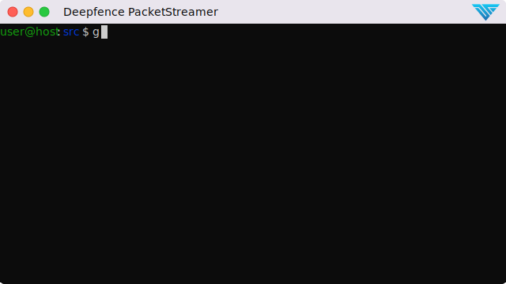

# Quick Start



## Build PacketStreamer


You will need to install the golang toolchain and `libpcap-dev` before building PacketStreamer.
  
```bash
# Pre-requisites (Ubuntu): sudo apt install golang-go libpcap-dev
git clone https://github.com/deepfence/PacketStreamer.git
cd PacketStreamer/
make
```

## Run a PacketStreamer receiver

Run a PacketStreamer receiver, listening on port **8081** and writing pcap output to **/tmp/dump_file** (see [receiver.yaml](https://github.com/deepfence/PacketStreamer/tree/main/contrib/config/receiver.yaml)):
  
```bash
./packetstreamer receiver --config ./contrib/config/receiver.yaml
```

## Run PacketStreamer sensors

Run one or more PacketStreamer sensors on local and remote hosts. Edit the **server address** in [sensor.yaml](https://github.com/deepfence/PacketStreamer/tree/main/contrib/config/sensor-local.yaml):

```bash
# run on the target hosts to capture and forward traffic

# copy and edit the sample sensor-local.yaml file, and add the address of the receiver host
cp ./contrib/config/sensor-local.yaml ./contrib/config/sensor.yaml

./packetstreamer sensor --config ./contrib/config/sensor.yaml
```
